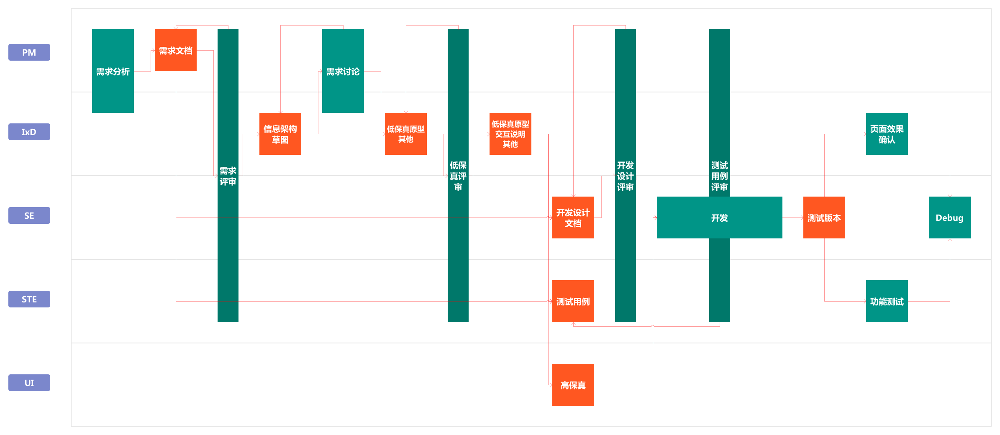

## 工作流

在金智教育，EDC 作为独立部门承担着全公司产品线的交互设计支持工作。本文以应用产品线为例，从交互设计师的工作视角，简单介绍产品开发的工作流程，交互设计师作为承接产品经理和开发人员、测试人员以及视觉设计师的中间环节，扮演着至关重要的角色。

关于交互设计工作流的具体内容，请移步至 EDC 官网查看：
[http://ued.wisedu.com/wordpress/2017/04/13/workflow/](http://ued.wisedu.com/wordpress/2017/04/13/workflow/)
